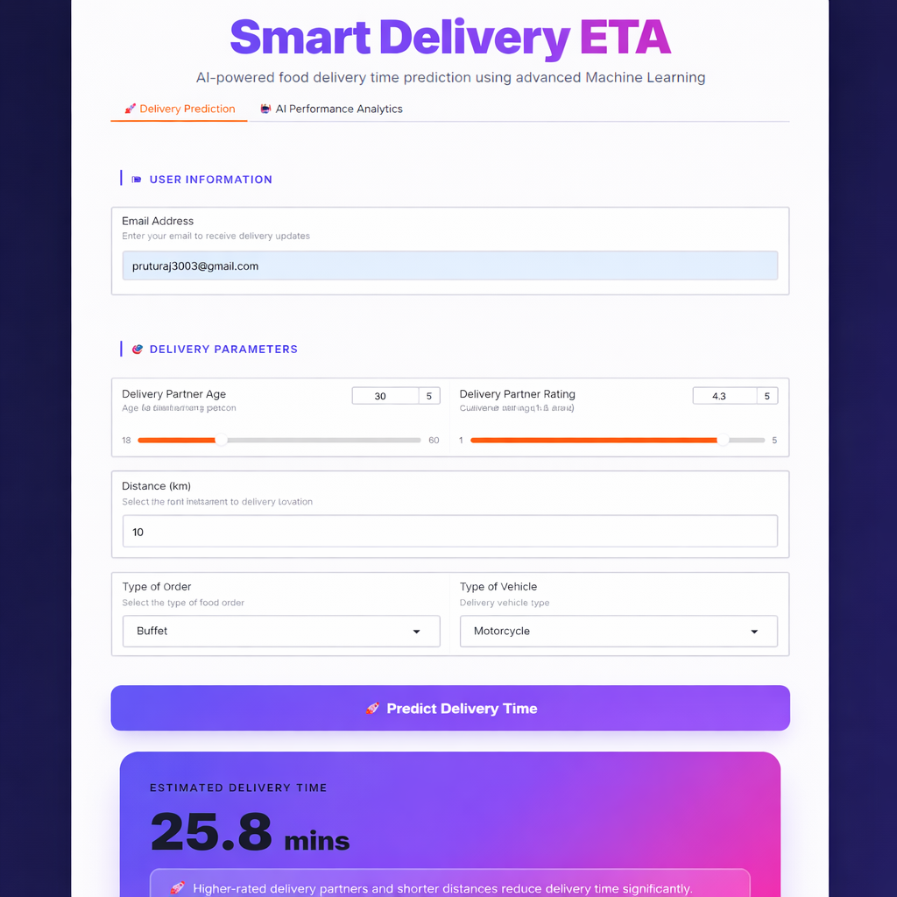
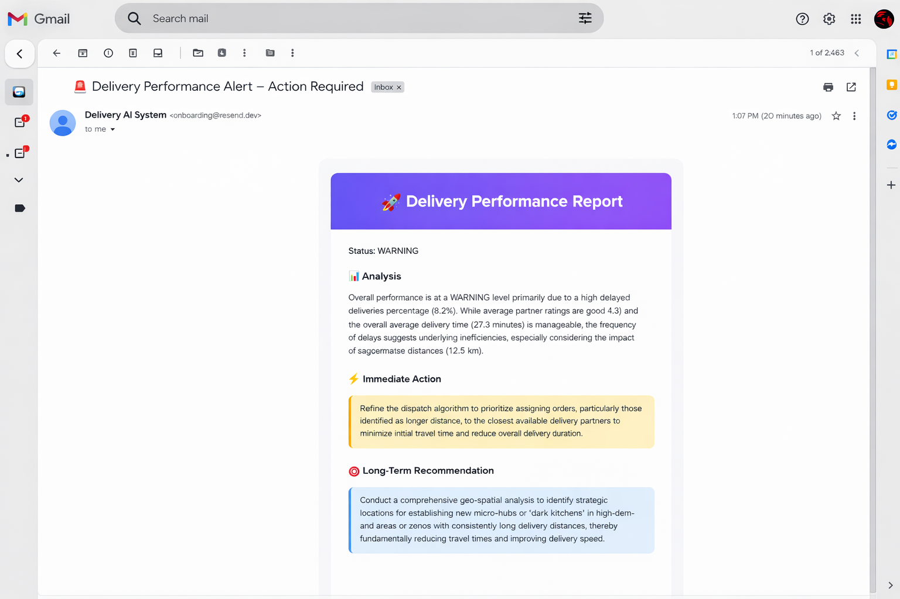
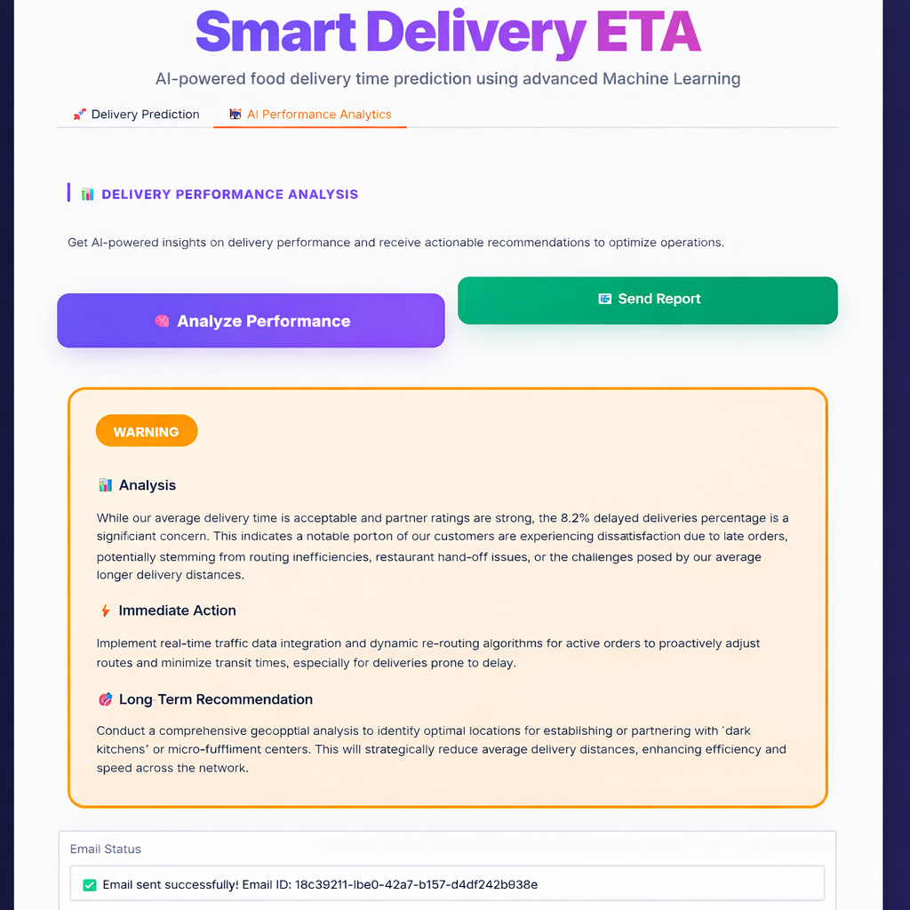

# AI DeliTime - Delivery Time Prediction System


An intelligent machine learning system that predicts food delivery times with high accuracy using delivery partner data, order characteristics, and location-based features.

**Google Colab Notebook:** [View Code](https://colab.research.google.com/drive/19Y488SJjMSvAu1YrgztGgknozYCvP_MG?usp=sharing)

---

## Screenshots
### Delivery Prediction


### Email Performance Report


### AI Performance Analytics



---

## Table of Contents

- [Problem Statement](#problem-statement)
- [Key Features](#key-features)
- [Project Architecture](#project-architecture)
- [Dataset Description](#dataset-description)
- [Methodology](#methodology)
- [Model Performance](#model-performance)
- [Installation](#installation)
- [Usage](#usage)
- [Tech Stack](#tech-stack)
- [Results & Insights](#results--insights)
- [Acknowledgments](#acknowledgments)
- [Contributors](#contributors)

---

## Problem Statement

Food delivery platforms operate in dynamic urban environments where accurate delivery time estimation is critical for customer satisfaction and operational efficiency. Traditional methods rely on static rules that fail to capture real-world variability.

**Objective:** Build an ML-based regression model to predict delivery time (in minutes) using historical delivery data and multiple influencing factors.

---

## Key Features

- **Intelligent Prediction** - ML-powered delivery time estimation using Gradient Boosting
- **Comprehensive EDA** - Visual insights into delivery patterns and correlations
- **Feature Engineering** - Haversine distance calculation for accurate location-based predictions
- **Modern UI** - Futuristic React interface with real-time predictions
- **AI-Powered Analytics** - Performance analysis using Google Gemini LLM
- **Email Integration** - Automated delivery of analysis results via Resend
- **Production Ready** - Saved model artifacts for seamless deployment
- **Model Comparison** - Evaluated multiple regression algorithms for optimal performance

---

## Project Architecture

```
Data Collection → EDA & Preprocessing → Feature Engineering → Model Training → Evaluation → Deployment
```

### Development Phases

**Phase 1: Data Understanding & Feature Engineering**
- Data cleaning and sanity checks
- Exploratory Data Analysis (EDA)
- Distance calculation using Haversine formula
- Categorical encoding and feature transformation

**Phase 2: Model Training & Evaluation**
- Train-test split (80-20)
- Model comparison (Linear Regression, Random Forest, Gradient Boosting)
- Performance evaluation (MAE, RMSE)
- Feature importance analysis

**Phase 3: Deployment & Integration**
- Model serialization (.pkl)
- Interactive web application with React
- Streamlit dashboard for analytics
- Real-time prediction interface
- Email notification system

---

## Dataset Description

| Feature | Description | Type |
|---------|-------------|------|
| `Delivery_person_Age` | Age of the delivery partner | Numerical |
| `Delivery_person_Ratings` | Rating of delivery partner (1-5) | Numerical |
| `Restaurant_latitude` | Restaurant location latitude | Numerical |
| `Restaurant_longitude` | Restaurant location longitude | Numerical |
| `Delivery_location_latitude` | Delivery location latitude | Numerical |
| `Delivery_location_longitude` | Delivery location longitude | Numerical |
| `Type_of_order` | Category of order | Categorical |
| `Type_of_vehicle` | Vehicle used for delivery | Categorical |
| `Time_taken(min)` | **Target Variable** - Delivery time | Numerical |

**Dataset Quality:**
- No missing values
- No duplicate entries
- Clean and ready for modeling

---

## Methodology

### 1. Data Preprocessing

```python
# Data validation
- Checked for nulls and duplicates
- Separated numerical and categorical features
- Validated data types and ranges
```

### 2. Feature Engineering

**Distance Calculation using Haversine Formula**

```python
from math import radians, sin, cos, sqrt, atan2

def haversine_distance(lat1, lon1, lat2, lon2):
    """
    Calculate great-circle distance between two points
    Returns distance in kilometers
    """
    R = 6371  # Earth's radius in kilometers
    
    lat1, lon1, lat2, lon2 = map(radians, [lat1, lon1, lat2, lon2])
    dlat = lat2 - lat1
    dlon = lon2 - lon1
    
    a = sin(dlat/2)**2 + cos(lat1) * cos(lat2) * sin(dlon/2)**2
    c = 2 * atan2(sqrt(a), sqrt(1-a))
    
    return R * c
```

**Categorical Encoding**
- `Type_of_order` → Numeric codes
- `Type_of_vehicle` → Numeric codes

### 3. Model Training

**Models Evaluated:**
1. Linear Regression (Baseline)
2. Random Forest Regressor
3. Gradient Boosting Regressor ✓ (Selected)

**Final Feature Set:**

```python
X = [
    'Delivery_person_Age',
    'Delivery_person_Ratings',
    'distance_km',  # Engineered feature
    'Type_of_order_encoded',
    'Type_of_vehicle_encoded'
]
```

---

## Model Performance

| Model | MAE | RMSE | Status |
|-------|-----|------|--------|
| Linear Regression | 6.64 | 8.46 | Baseline |
| Random Forest | 5.71 | 7.26 | Good |
| **Gradient Boosting** | **5.67** | **7.21** | **✓ Selected** |

**Performance Improvement:**
- Gradient Boosting achieved **14.6% better MAE** compared to Linear Regression baseline
- RMSE improved by **14.8%**, demonstrating superior prediction accuracy
- Random Forest showed competitive performance with slight edge given to Gradient Boosting


### Feature Importance

1. **distance_km** - Most influential predictor
2. **Delivery_person_Ratings** - Strong predictor
3. **Delivery_person_Age** - Moderate impact
4. **Type_of_vehicle_encoded** - Minor impact
5. **Type_of_order_encoded** - Minor impact

---

## Installation

### Prerequisites

- Python 3.8+
- Node.js 16+
- npm or yarn

### Backend Setup

```bash
# Clone the repository
git clone https://github.com/yourusername/ai-delitime.git
cd ai-delitime

# Create virtual environment
python -m venv venv
source venv/bin/activate  # On Windows: venv\Scripts\activate

# Install dependencies
pip install -r requirements.txt
```

### Frontend Setup

```bash
# Navigate to frontend directory
cd frontend

# Install dependencies
npm install

# Start development server
npm start
```

---

## Usage

### Training the Model

```python
# Load and prepare data
import pandas as pd
from sklearn.model_selection import train_test_split
from sklearn.ensemble import GradientBoostingRegressor
import pickle

# Load dataset
df = pd.read_csv('Dataset.csv')

# Feature engineering
df['distance_km'] = haversine_distance(
    df['Restaurant_latitude'],
    df['Restaurant_longitude'],
    df['Delivery_location_latitude'],
    df['Delivery_location_longitude']
)

# Train model
model = GradientBoostingRegressor()
model.fit(X_train, y_train)

# Save model
pickle.dump(model, open('delivery_time_model.pkl', 'wb'))
```

### Making Predictions

```python
# Load model
model = pickle.load(open('delivery_time_model.pkl', 'rb'))

# Prepare input
input_data = [[25, 4.5, 5.2, 1, 2]]  # age, rating, distance, order, vehicle

# Predict
predicted_time = model.predict(input_data)
print(f"Estimated Delivery Time: {predicted_time[0]:.2f} minutes")
```

### Using the Web Interface

1. Open the web application
2. Adjust delivery partner age using the slider
3. Set delivery partner ratings (1.0 - 5.0)
4. Enter distance in kilometers
5. Select order type and vehicle type
6. Enter email address
7. Click "RUN ANALYSIS"
8. Receive prediction results and AI-powered insights via email

---

## Tech Stack

### Machine Learning
- **Python 3.8+** - Core programming language
- **Scikit-learn** - Model training and evaluation
- **Pandas** - Data manipulation
- **NumPy** - Numerical operations
- **Matplotlib/Seaborn** - Data visualization

### AI & Automation
- **Streamlit** - Analytics dashboard
- **Google Gemini** - LLM-powered performance analysis
- **Html** - Frontend
- **CSS** - Frontend
- **Resend** - Email delivery service

### Deployment
- **Pickle** - Model serialization
- **Flask/FastAPI** - Backend API

---

## Results & Insights

### Key Findings from EDA

**1. Delivery Time Distribution**
- Normal distribution centered around 20-30 minutes
- Range: 10-60 minutes
- Peak frequency: ~25 minutes

**2. Rating Impact**
- Higher-rated partners deliver faster
- Strong negative correlation with delivery time
- Ratings > 4.0 show consistent performance

**3. Vehicle Type Analysis**
- **Motorcycle** - Most consistent delivery times
- **Scooter** - Slightly slower, similar variance
- **Bicycle** - Highest variance, weather-dependent
- **Electric Scooter** - Moderate performance

**4. Distance Effect**
- Strong positive correlation (r > 0.7)
- Linear relationship up to 15km
- Non-linear patterns beyond 15km

---

## Acknowledgments

Special thanks to **Intruv AI Hackathon** for organizing this challenge and providing the opportunity to develop this solution.


---

## Contributors

**Developed by First Round AI**

- **Piyush Kokane** - [@piyush-kokane](https://github.com/piyush-kokane)
- **Ruturaj Pawar** - [@Ruturaj-007](https://github.com/Ruturaj-007)

---

**⭐ Star this repository if you found it helpful!**

*Made with dedication by the First Round AI team*